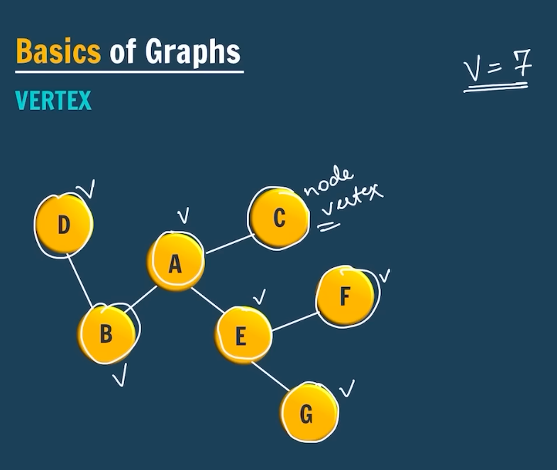
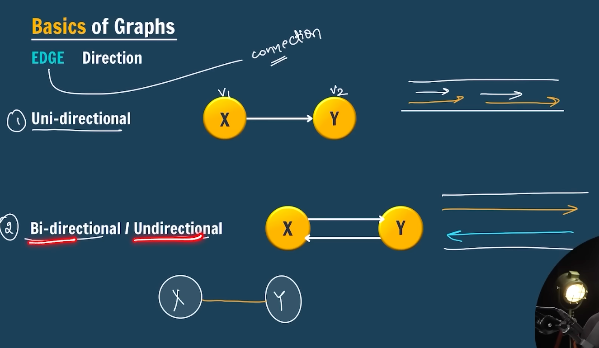
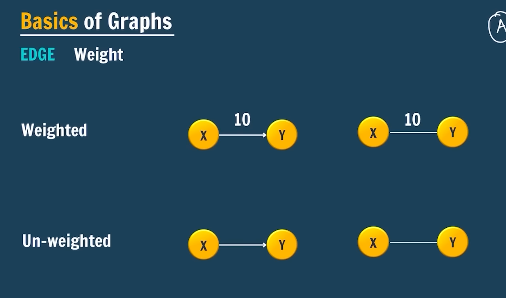

# Graphs Data Structure

Instructions

- Download notes
- Download Assignments

---

**Graphs**: Network of Nodes

**Basics of Graphs**

- Vertex: 
- Edge: 
- Weights: 

---

**Storing a Graph**

- _Adjacency List_: List of lists
  [Adjacency List](adjacency.png)

```java
// v = 4, e=5; undirected unwighted

// vetex-wise
// 0 - {0,2}
// 1 - {1,2},{1,3}
// 2 - {2,0},{2,1},{2,3}
// 3 - {3,1},{3,2}

// ArrayList of ArrayList
// HashMap
// Array of Arraylist
// ArrayList<Edge> graph[]

static class Edge{
  int source;
  int destination;
}

```

- _Adjacency Matrix_:
  - Space complexity: O(v^2)
  - neighbour O(v)
- _Edge List_:
  - {{0,2},{1,2},{1,3},{2,3}}
  - used when there's sorting of edges is involved
- _2-D Matrix_:
