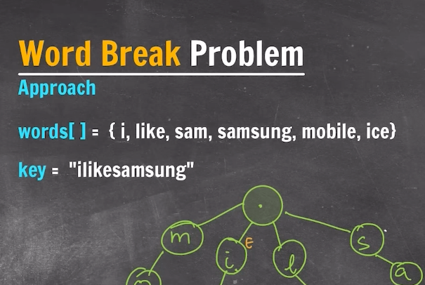

Trie - Data Structure : Prefix tree, digital search tree, Re"trie"val tree

```
words[] = {"there","a", "there","their","any"}

```

worst-case of a BST - search time complexity : O(n) - skewed BST
worst-case of a AVL - search time complexity : O(log(n))
worst-case of a trie - search time complexity : O(L)

---

### Problems




